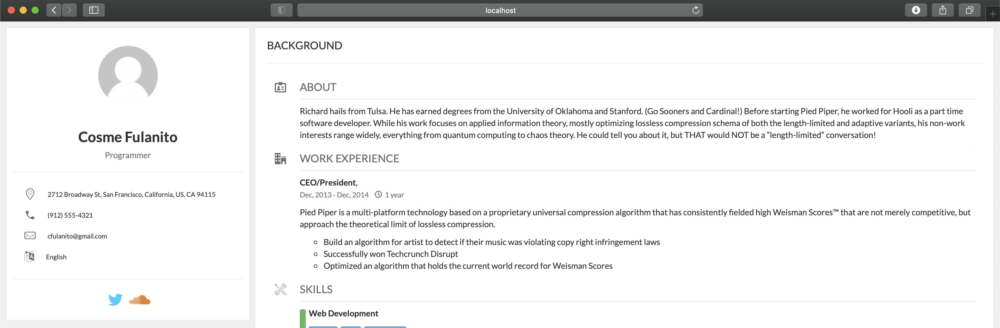

# Dudas:
En la version 1 el repositorio esta dentro del provisionamiento. Cual seria una estrategia para hacer un CI/CD directo desde github? Supongo en un ambiente controlado el provisioning se haria directo en el script de integracion no? 

Capaz que el repo quede afuera (En el directorio vagrant) y en cambio de copiar el resultado hacer un symlink, entonces en el directorio se compila. 

La otra es cronear la tarea de update y contruccion cada x tiempo para que se actualize solo

Son estrategias que se me ocurren

# Repo

[github](https://github.com/gdelacruz/cv-vagrant)

# Version 1 (Shell provisioning)

Esta basado en el repositorio de la [actividad 3](actividad-03.md)

<pre >

➜  cv_vagrant git:(master) ✗ vagrant init ubuntu/bionic64
A `Vagrantfile` has been placed in this directory. You are now
ready to `vagrant up` your first virtual environment! Please read
the comments in the Vagrantfile as well as documentation on
`vagrantup.com` for more information on using Vagrant.

➜  cv_vagrant git:(master) ✗ nano Vagrantfile 

</pre>

Agregue esto a VagrantFile

<pre>
  config.vm.network "forwarded_port", guest: 80, host: 8080, host_ip: "127.0.0.1"

  config.vm.provision :shell, inline: <<-SHELL
  
    echo "** Installing node apt **"
    curl -sL https://deb.nodesource.com/setup_current.x -o nodesource_setup.sh
    bash nodesource_setup.sh
    
    echo "** Installing Packages **"
    apt install -y git
    apt install -y nodejs
    apt install -y apache2
    apt install -y build-essential

    apt-get upgrade -y
    apt-get autoremove -y

    echo "** Installing myresume **"
    if  [[ ! -d myresume ]]
    then
      echo "Cloning project"
      git clone https://gitlab.com/gdelacruz/myresume.git
    fi
    
    cd myresume
    git pull
    
    echo "** Compiling myresume **"
    npm i
    mkdir -p public/
    npm run resume export -- --theme elegant public/index.html 
    cp public/index.html /var/www/html/index.html

    echo "** Done **"
  SHELL
</pre>

Sigo  la ejecucion

<pre>
➜  cv_vagrant git:(master) ✗ vagrant up
Bringing machine 'default' up with 'virtualbox' provider...
==> default: Importing base box 'ubuntu/bionic64'...
==> default: Matching MAC address for NAT networking...
==> default: Checking if box 'ubuntu/bionic64' version '20201104.0.0' is up to date...
==> default: Setting the name of the VM: cv_vagrant_default_1604676822334_85799
==> default: Clearing any previously set network interfaces...
==> default: Preparing network interfaces based on configuration...
    default: Adapter 1: nat
==> default: Forwarding ports...
    default: 80 (guest) => 8080 (host) (adapter 1)
    default: 22 (guest) => 2222 (host) (adapter 1)
==> default: Running 'pre-boot' VM customizations...
==> default: Booting VM...

....

[Por extension, recorto parte del resultado], 
Clona el proyecto desde github

....

    default: Cloning project
    default: Cloning into 'myresume'...
    default: Already up to date.
    default: ** Compiling myresume **
    default: npm

.....
[Por extension, recorto parte del resultado]
.....

    default: 
    default: Done! Find your new .html resume at:
    default:  /home/vagrant/myresume/public/index.html
    default: Your resume-cli software is up-to-date.
    default: ** Done **
➜  cv_vagrant git:(master) 

</pre>

Desde el explorador, voy a http://localhost:8080

Vuelvo a provisionar el equipo

<pre>
➜  cv_vagrant git:(master) vagrant provision 
==> default: Running provisioner: shell...
    default: Running: inline script
    default: ** Installing node apt **
    default: 
.....
[Por extension, recorto parte del resultado]
.....

    default: ** Installing myresume **

...
No se vuelve a bajar el repositorio, pero si se actualiza desde gitlab
...

    default: Already up to date.
    default: ** Compiling myresume **
    default: 
    default: up to date, audited 283 packages in 3s
    default: 32 packages are looking for funding
    default:   run `npm fund` for details
    default: 
    default: 4 low severity vulnerabilities
    default: 
    default: To address issues that do not require attention, run:
    default:   npm audit fix
    default: 
    default: To address all issues (including breaking changes), run:
    default:   npm audit fix --force
    default: 
    default: Run `npm audit` for details.
    default: 
    default: > myresume@1.0.0 resume
    default: > resume "export" "--theme" "elegant" "public/index.html"
    default: callback is not a function
    default: 
    default: Done! Find your new .html resume at:
    default:  /home/vagrant/myresume/public/index.html
    default: ** Done **
</pre>

# Version 2 (Con Ansible)

** TODO **